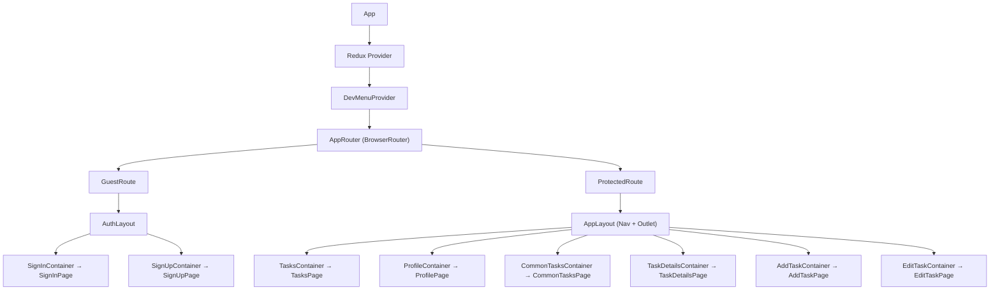
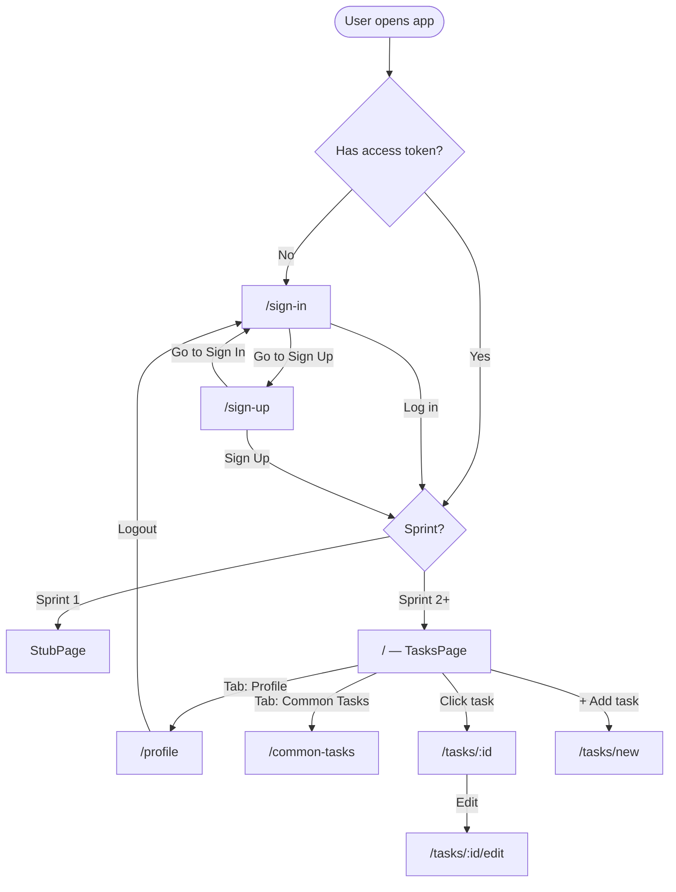
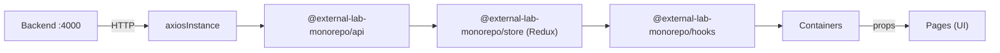

# Frontend App — Architecture

## 1. Component Tree

Дерево компонентов приложения: от корневого `App` через провайдеры и роутер до страниц и переиспользуемых UI-компонентов.

Mermaid source

### Ключевые моменты

- **Container/Presentational** паттерн: каждая страница разделена на Container (логика, хуки, стейт) и Page (UI через пропсы)
- **GuestRoute** — редирект на `/` если есть токен
- **ProtectedRoute** — редирект на `/sign-in` если нет токена
- **AuthLayout** — фиолетовый фон для auth-страниц
- **AppLayout** — навигация (табы) + контент

---

## 2. Navigation Flow

Флоу навигации пользователя: от открытия приложения через авторизацию к основным экранам.

Mermaid source

### Маршруты

| Route | Page | Auth |
|-------|------|------|
| `/sign-in` | SignInPage | Guest only |
| `/sign-up` | SignUpPage | Guest only |
| `/` | TasksPage | Protected |
| `/profile` | ProfilePage | Protected |
| `/common-tasks` | CommonTasksPage | Protected |
| `/tasks/:taskId` | TaskDetailsPage | Protected |
| `/tasks/new` | AddTaskPage | Protected |
| `/tasks/:taskId/edit` | EditTaskPage | Protected |

### Sprint Gating

| Sprint | Доступно |
|--------|----------|
| 1 | Auth only → StubScreen |
| 2 | Tasks (read-only), Profile |
| 3 | Full CRUD, Common Tasks |
| 4 | + Priority selector, password toggle, horizontal profile buttons |

---

## 3. Data Flow

Поток данных: от бэкенда через API-пакет, Redux store и хуки до контейнеров и страниц.

Mermaid source

### Слои

1. **Backend** (`localhost:4000`) — Express + SQLite, REST API
2. **API Package** (`@external-lab-monorepo/api`) — Axios instance с auth interceptor, функции для каждого endpoint
3. **Store** (`@external-lab-monorepo/store`) — Redux Toolkit: 4 слайса (auth, tasks, currentUser, commonTasks), async thunks
4. **Hooks** (`@external-lab-monorepo/hooks`) — React хуки поверх Redux: `useAuth`, `useTasks`, `useTask`, `useCurrentUser`, `useCommonTasks`
5. **Containers** — вызывают хуки, управляют стейтом, передают пропсы
6. **Pages** — чистый UI, принимают данные и колбэки через пропсы

### Общие пакеты (shared с mobile)

| Package | Содержимое |
|---------|-----------|
| `@external-lab-monorepo/types` | Task, CommonTask, User, TaskPriority |
| `@external-lab-monorepo/constants` | SPRINTS enum, TASKS_PER_PAGE |
| `@external-lab-monorepo/api` | Axios API calls |
| `@external-lab-monorepo/store` | Redux store + actions + reducers |
| `@external-lab-monorepo/hooks` | React hooks |
